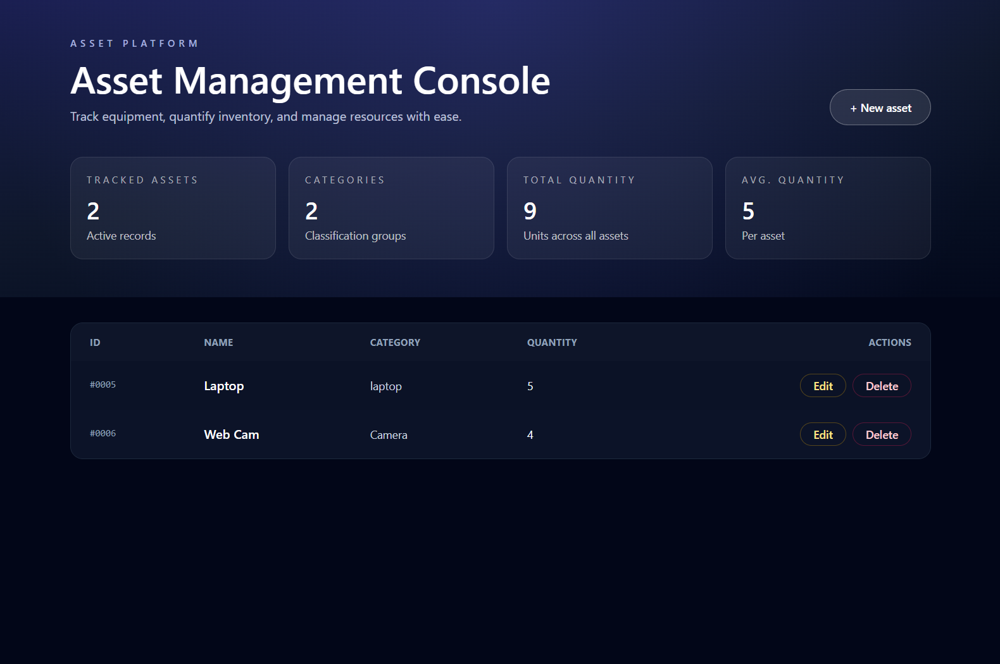

# practice-itam-app

Simple IT asset management playground that pairs a Node/Express API (with Drizzle ORM + SQLite) and a Vite/React frontend. Used it to practice CRUD flows, UI state management, and lightweight full-stack wiring.

## Tech stack

- Backend: TypeScript, Express, Drizzle ORM, SQLite
- Frontend: Vite, React, TypeScript, Tailwind CSS

## Project structure

- `asset-manager-backend/` – REST API, database layer, migrations
- `asset-manager-frontend/` – React client (components, API hooks, styles)

